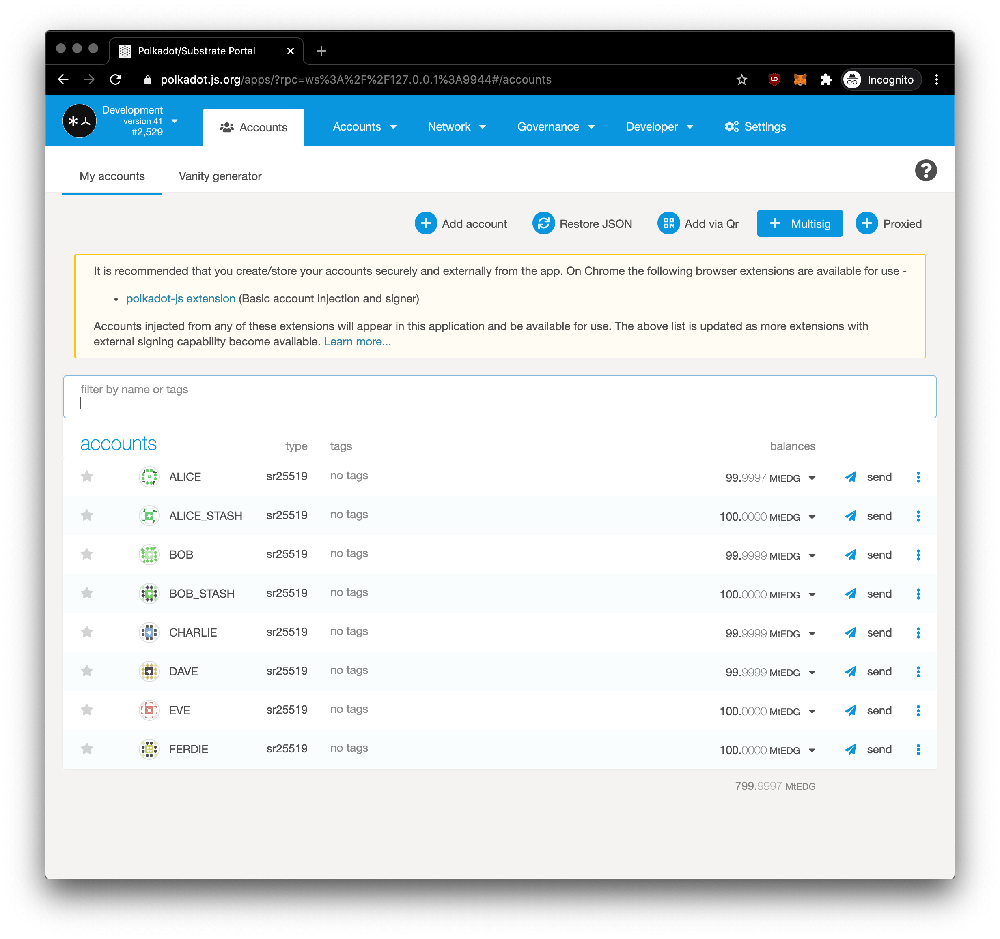
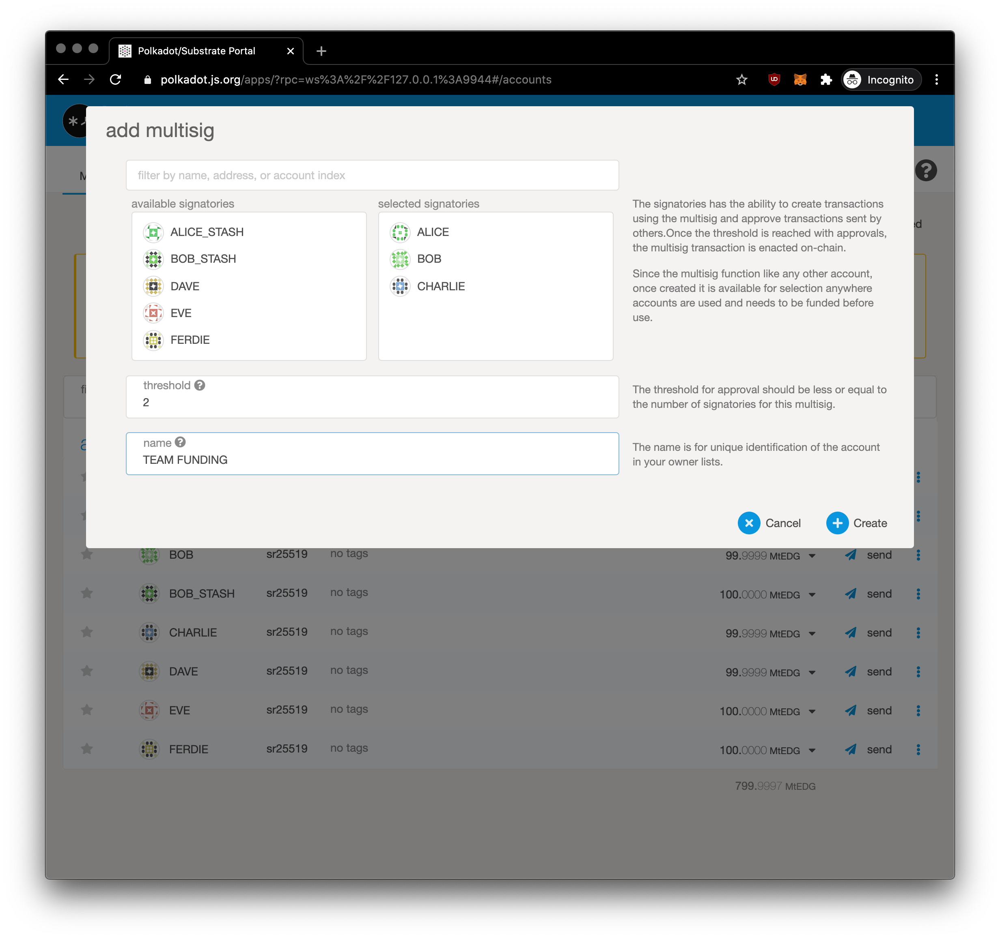
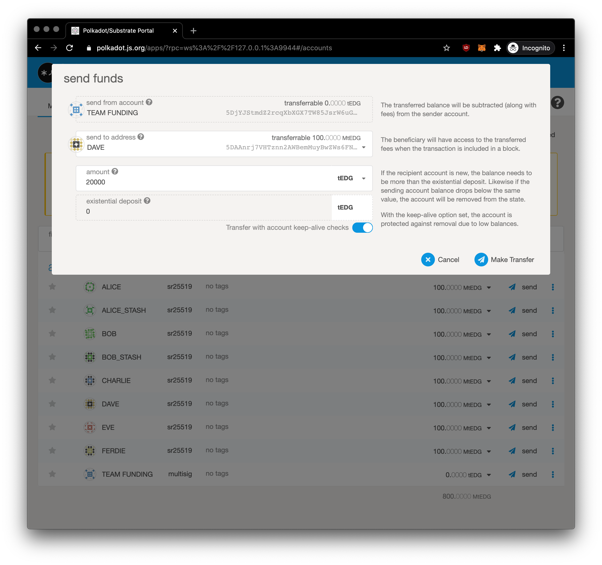

## Create Multi Signature Account through Apps

You will go to the [Accounts in Apps](https://polkadot.js.org/apps/#/accounts)

You will choose your signatures, i.e. your team mates accounts, in our scenario we choose **Alice, Bob and Charlie**. We set **threshold to 2**, that means there is only needed signature from **two of three**. You can set threshold to be less or equal to the number of signatories for multisig. We call it our **Team Funding** account. 

Now we gonna top-up **1,000,000** tEDG to the **Team Funding** multi-signature account from **Alice**. Thank you Alice!

Now come to the time when Team has need to pay-up for service delivery to the **DAVE** **200,000** tEDG. In our accounts list, hit **Send** from our **Team Funding** account

Now we are prompted (**as ALICE**) to authorize transaction. 

You will see there `multisig call data` with payload 
`0x0603ff306721211d5404bd9da88e0204360a1a9ab8b87c66c1bc2fcdd37f3c2222cc201b000000ed95c28f055a2a` which is call data that can be supplied to a final call to multi approvals. It's what triggers chain logic to execute commands. You will hit Sign and Submit.

It was broadcasted to the chain, you can see notification on the top right.

Now we click on the right three dots next to our **Team Funding** account as there is multisig approvals pending (*red dot*) and select **Send**

You as other signator (**BOB**) enter same amount and destination to **get same final call payload**.

Now we as **BOB** we can authorize transaction. UI is smart enough and detected it's final approval. Under toggle *Multisig message* you will see same payload as we're creating multisig transaction.
Hit Sign and Submit and it's should be signed 2 of 3 signatories which is enough for this scenario so can transaction can pass through to DAVE.

Woala, DAVE has money, **funds secured** on his account.

You've managed to learn how to make transaction for multi-signature. Multisignature has broad usecase and you can leverage final call for your use case to trigger what ever you want on chain.