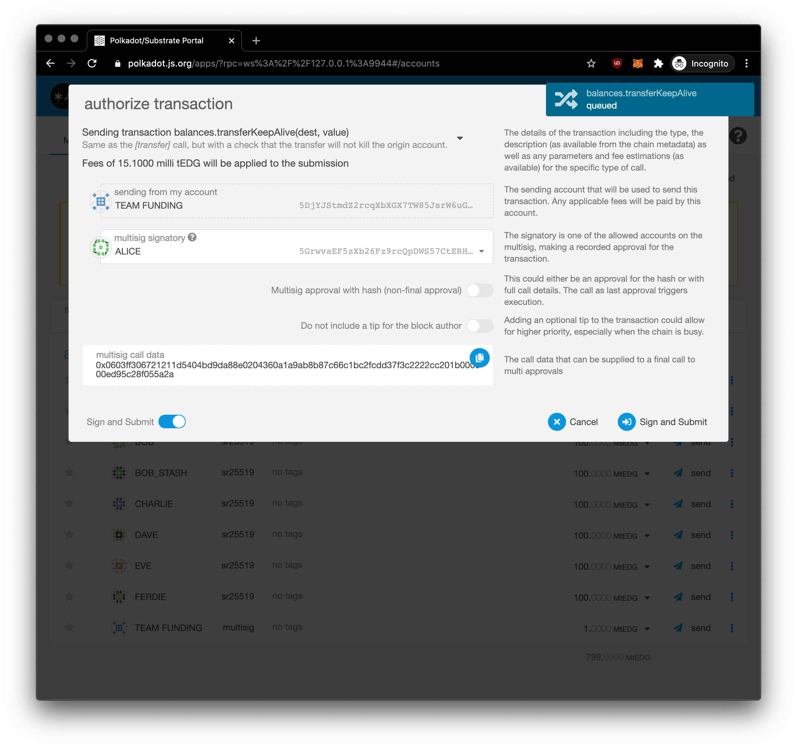

# Create Multi Signature Account

We will create a Multi-Signature account using a local Edgeware development network and perform a test transaction from the account. You will have to make sure you have a [local development node running](../../development/develop/smart-contracts/evm-smart-contracts/tutorials/deploy-an-evm-contract/setting-up-a-edgeware-evm-node.md) for this tutorial.

Once a development node is active, you're going to click on this link: \[development node in accounts]

Now you will choose your signatures, i.e. your teammates accounts. In our scenario, we choose **Alice, Bob, and Charlie**. We set the **threshold to 2**, which means there is only needed signature from **two of three**. You can set threshold to be less or equal to the number of signatories for multisig. We call it our **Team Funding** account.

Now we will top-up **1,000,000** tEDG to the **Team Funding** multi-signature account from **Alice**. Thank you Alice!

## Create Transfer from Multi-Signature Account

Now that the **Team Funding** account has been seeded, we can pay **DAVE** **200,000** tEDG for completion of a project. In our accounts list, hit **Send** from our **Team Funding** account

 (1).png>)

Now we are prompted (**as ALICE**) to authorize transaction.

You will see there `multisig call data` with payload `0x0603ff306721211d5404bd9da88e0204360a1a9ab8b87c66c1bc2fcdd37f3c2222cc201b000000ed95c28f055a2a` which is call data that can be supplied to a final call to multi approvals. It's what triggers chain logic to execute commands. You will hit Sign and Submit.

It was broadcasted to the chain, you can see notification on the top right.

Now we click on the right three dots next to our **Team Funding** account as there is multisig approvals pending (_red dot_) and select **Send**

You as other signator (**BOB**) enter same amount and destination to **get same final call payload**.

 (1) (1).png>)

Now we as **BOB** we can authorize transaction. UI is smart enough and detected it's final approval. Under toggle _Multisig message_ you will see same payload as we're creating multisig transaction. Hit Sign and Submit and it's should be signed 2 of 3 signatories which is enough for this scenario so can transaction can pass through to DAVE.

Woala, DAVE has money, **funds secured** on his account.

You've managed to learn how to make transaction for multi-signature. Multisignature has broad usecase and you can leverage final call for your use case to trigger what ever you want on chain.
