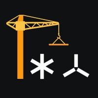

# Develop

Edgeware has [wg-builders](https://commonwealth.im/edgeware/discussions/wg-builders) group where you can discuss about your project, aims of developers community on Edgeware, usability and feasibility with Edgeware community developers.

## Projects

Mayor part of developers projects can be found at [Edgeware's Builders Guild repositories](https://github.com/edgeware-builders/) and you are welcome to contribute to [awesome-edgeware](https://github.com/edgeware-builders/awesome-edgeware) where we map Edgeware ecosystem projects

## Engage

You can follow [Edgeware Builders Guild at Twitter](https://twitter.com/edg_developers), [join and engage with them at Telegram](https://t.me/edg_developers), [Element](https://matrix.to/#/!ddnLMXyILAzUofbiMe:matrix.org?via=matrix.org\&via=t2bot.io), [Discord](https://discord.gg/njDnHDk)

## Learn

Edgeware has support for EVM Dapps and for ink! smart contract pallet as well. You can learn [how to play with EVM](https://contracts.edgewa.re/#/4/evm-introduction) or [learn how to deploy your first ink! smart contract](https://contracts.edgewa.re/#/0/introduction).

If you are looking for [advanced topics, you can play around with prepared examples, likes erc721, multisig_plain, delegator, dns](https://contracts.edgewa.re/#/3/introduction)

## Funding

If you have project in terms of User Interface, System Integrations, Tools, Reasearch, Application-specific you can apply to [Construction Projects for grant funding your project](https://github.com/edgeware-builders/construction-projects).

## Resources

* [Join Edgeware community](https://linktr.ee/edg_developers)
* [Substrate News and Resources](https://substrate.dev/awesome-substrate/)
* [Solang Solidty-Substrate Compiler](https://github.com/hyperledger-labs/solang)
