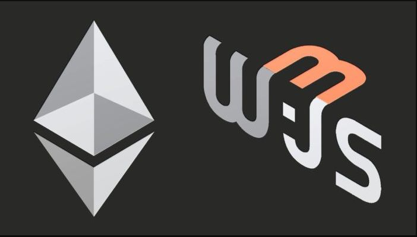

# Web3.js

  
Web3.js is a collection of libraries that allows programmers to interact with these on-chain components, by being able to facilitate a connection to Ethereum nodes.‌

In Ethereum, nodes provide low-level interfaces for users to submit transactions. Transactions can be received by a node through a [JSON RPC](https://github.com/ethereum/execution-apis) interface. JSON RPC is a textual encoding format allowing running processes to receive data. Nodes participating in the Ethereum network may choose to expose this interface in different ways, depending on its configuration and the underlying software implementation. Common options include HTTP connections, IPC or WebSockets.‌

For the full user documentation, and API reference for web3.js, [click here](https://web3js.readthedocs.io/en/v1.5.2/).

### Tutorial for using Web3.js on Edgeware



