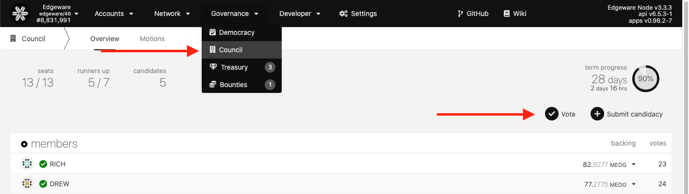
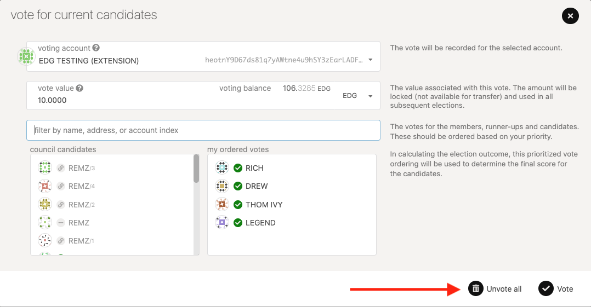

# Voting for Council

## Intro 

The council is an elected body of on-chain accounts that are intended to represent the passive stakeholders of Edgeware. The council has two major tasks in governance: proposing referenda and vetoing dangerous or malicious referenda. This guide will walk you through voting for councillors in the elections.

### Voting for Councillors

Voting for councillors requires you to lock your EDG for the duration of your vote. Like the validator elections, you can approve up to 16 different councillors and your vote will be equalized among the chosen group. Unlike validator elections, there is no unbonding period for your reserved tokens. Once you remove your vote, your tokens will be liquid again.

> Warning: It is your responsibility not to put your entire balance into the reserved value when you make a vote for councillors. It's best to keep _at least_ a few EDG to pay for transaction fees.

Go to the [Polkadot Apps Dashboard](https://polkadot.js.org/apps), **connect to the Edgeware endpoint**, and click on the "Council" tab. On the right side of the window there are two blue buttons, click on the one that says "Vote."

Since the council uses approval voting, when you vote you signal which of the validators you approve of and your voted tokens will be equalized among the selected candidates. Select up to 16 council candidates by moving the slider to "Aye" for each one that you want to be elected. When you've made the proper configuration submit your transaction.

#### Voting for council members[¶]

1. Choose who you want to vote for you can choose up to 16 
2. Enter in your vote value that you want to use. then click vote
3. Click `Sign and Submit` and sign the transaction.

You should see your vote appear in the interface immediately after your transaction is included.

### Removing your Vote

In order to get your reserved tokens back, you will need to remove your vote. Only remove your vote when you're done participating in elections and you no longer want your reserved tokens to count for the councillors that you approve. Go back to vote and then click Unvote all.

Go to the "Extrinsics" tab on [Substrate Apps Dashboard](https://polkadot.js.org/apps).

Choose the account you want to remove the vote of and select the "electionsPhragmen -&gt; removeVoter\(\)" options and submit the transaction.

When the transaction is included in a block you should have your reserved tokens made liquid again and your vote will no longer be counting for any councillors in the elections starting in the next term.

