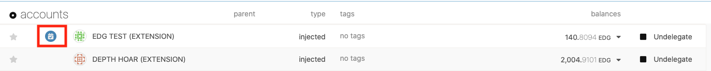
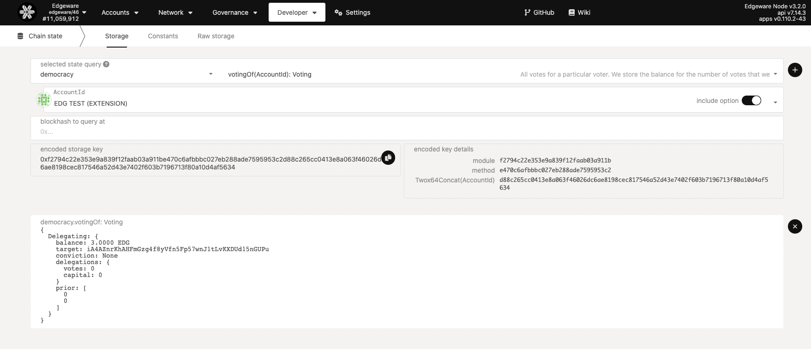

# Delegation

If you are too busy to keep up and vote on upcoming referenda, there is an option to delegate your vote to another account whose opinion you trust. When you delegate to another account, that account gets the added voting power of your tokens along with the conviction that you set. The conviction for delegation works just like the conviction for regular voting, except your tokens may be locked longer than they would normally since locking resets when you undelegate your vote.

The account that is being delegated to does not make any special action once the delegation is in place. They can continue to vote on referenda how they see fit. The difference is now when the Democracy system tallies votes, the delegated tokens now are added to whatever vote the delegatee has made.

You can delegate your vote to another account and even attach a "Conviction" to the delegation. Navigate to the "Governance" tab and choose "Delegation". You can choose an account to delegate to along with conviction a conviction amount. Your delegation will count toward whatever the account you delegated for votes on until you explicitly undelegate your vote.

[delegation](https://edgeware.app/#/delegation)

- First input "delegating account" is an account you control that you want to use to delegate.
- In the second input "delegated account" input put in another account that you trust that will vote for you.
- Third input put in the amount you want to delegate.
- Fourth input your conviction. Remember, higher convictions means that your vote will be locked longer. So choose wisely!
- Note that you can delegate to only one account at a time. You can use other accounts to delegate to others.

After you send the delegate transaction, You should see an icon beside the account you used like this. You can also click on the icon to edit your delegation.

Alternatively you can verify it went through by navigating to the "Chain State" tab and selecting the "democracy" and "votingOf(Accountid): Voting" options. You will see an output similar to below, showing the addresses to which you have delegated your voting power.

## Undelegate

You may decide at some point in the future to remove your delegation to a target account. In this case, your tokens will be locked for the maximum amount of time in accordance with the conviction you set at the beginning of the delegation. For example, if you chose "2x" delegation for four weeks lock up time, your tokens will be locked for 4 weeks after sending the `undelegate` transaction. Once your vote has been undelegated, you are in control of making votes with it once again. You can start to vote directly, or chose a different account to act as your delegate.
