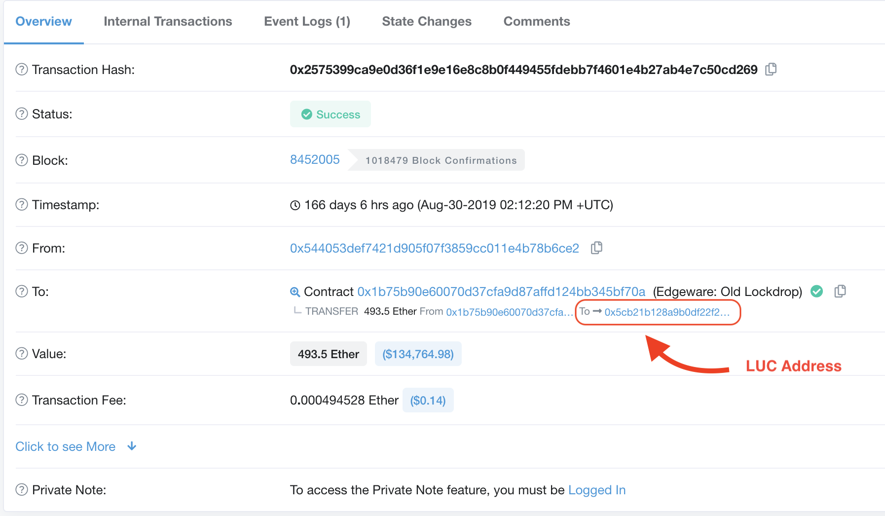

# Find your Lockdrop User Contract (LUC)

There are two ways to discover your LUC address if you haven't stored it:



Visit a block explorer like [Etherscan.io](http://etherscan.io) or others.

Enter your participating ETH address and view the list of transactions to find one or more that show the destination of "Edgeware Lockdrop Contract" It may also say "Old" - this is still a valid lock.

Your block explorer may not give the contract title. In this case, transactions to the following contract addresses are to the Master Lockdrop Contracts:

* `0x1b75B90e60070d37CfA9d87AFfD124bB345bf70a` (V.1, Old)
* `0xFEC6F679e32D45E22736aD09dFdF6E3368704e31` (v.2 New)

Click the transaction ID of these to see the final destination of the funds - the MLC does not hold your ETH, but sends it immediately to a newly created LUC. The transaction should show you a trail from your ETH Address - > MLC - > LUC.

Click into your LUC addresses to check the LUC for balance and contract data.



Visit the lockdrop stats page on Commonwealth.im:\
[https://commonwealth.im/edgeware/stats](https://commonwealth.im/edgeware/stats)

**If this page is unavailable or not functional, switch to the Block Explorer method tab.**

Scroll to the bottom and enter your participating ETH address/es into the bottom field.

This will show you:

* All instances of your LUCs generated from that address
* Their unlock times 
* And ETH locked per LUC. 




[retrieve-your-eth](retrieve-your-eth/)

