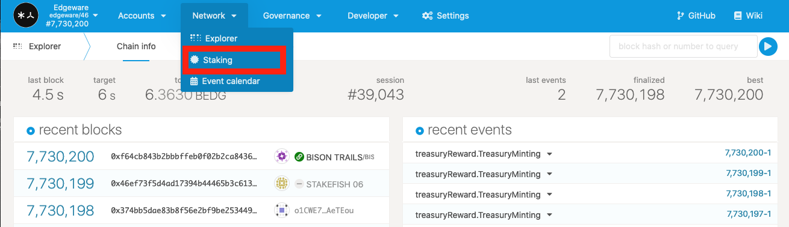
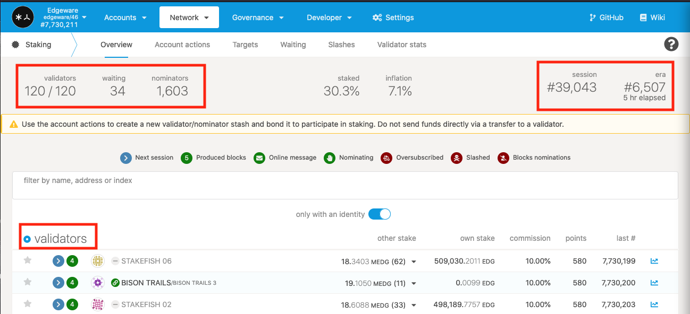
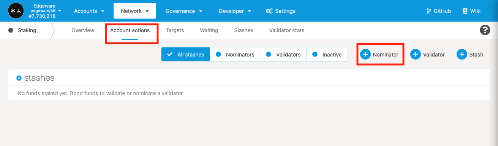
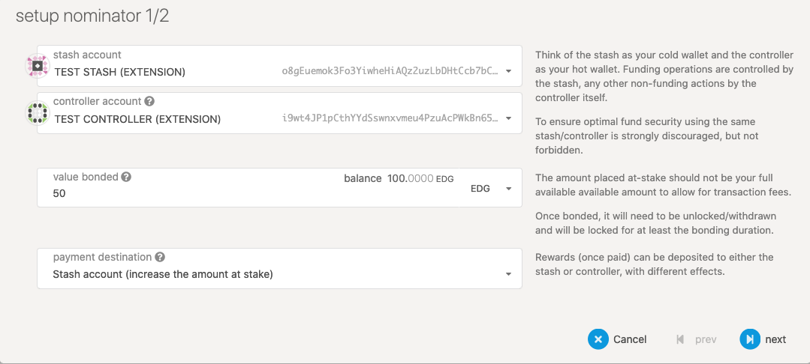
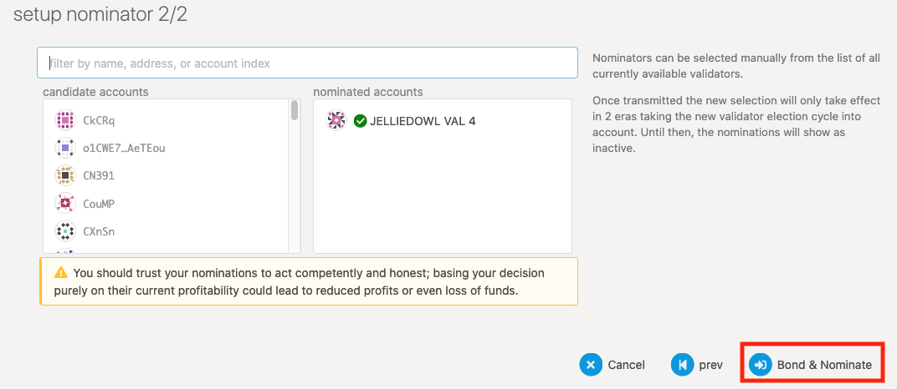
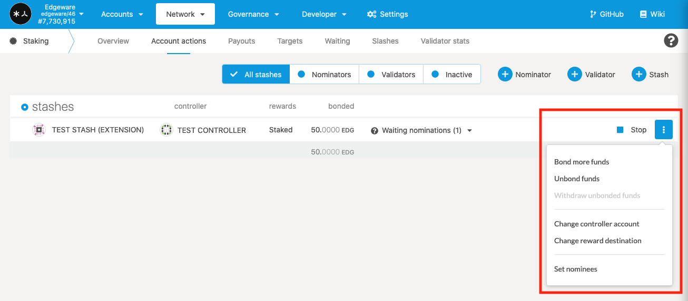

# How to stake on Edgeware

## NPoS - Nominated Proof of Stake

Nominated Proof of Stake is the process of selecting validators to be allowed to participate in the consensus protocol. NPoS is a similar to Proof of Stake and is used in Substrate based Blockchains such as Edgeware, Polkadot and Kusama.

## Go to the Edgeware Network

* Go to _polkadot.js.org/apps_
* Switch to Edgeware network from the drop down menu in the top left
  * Live Networks.
  * Edgeware.
  * Switch (at the top).

.png>)

## Stash and Controller accounts

* It is recommended to use two different accounts for Stash and Controller but not mandatory.
* Think of the Stash account as the the cold storage wallet with the funds.
* Think of the Controller account as a hot wallet that acts on behalf of the Stash account.
* Create the accounts and allocate EDG accordingly.

## Staking

* Click on Network then Staking.

## Choosing a Validator

* You will see all the validators listed with various information on top.
* Only a certain amount of validators can be active at a time 120.
* 34 are waiting to be validators. 
* 1,603 accounts that are nominating (people lending EDG to validators for staking purposes).

* Click on Account actions and +Nominator 

* Choose the appropriate accounts.
* Value Bonded (how much do you want to stake you shouldn’t stake the whole thing, leave a little left over for transaction/command purposes)
* Payment destination. 
* Stash account (increase the amount at stake) in other words automatically stake any interest you make.
* Stash account (do not increase the amount at stake) not staking the interest and have the funds immediately available. 
* Click next.

* Choose the validators you want to nominate. (You can pick more than one, in fact it is a good idea to do so. If the validator you nominated becomes inactive you will not be earning rewards. Do your due diligence when choosing validators) Want to learn more click [here](https://www.youtube.com/watch?v=l3IoHHxZoX0\&t=311s) for a good explanation. 
* Click Bond & Nominate.

* Click sign and submit (enter password).
* Bonding duration is 14 days. Meaning when you want to claim your EDG you have to first unbond them. Once this is done you have to wait 14 days to be able to claim them.

## Stashes

* Click on Account actions and you will see your active stash accounts and other information.
* To stop staking and start unbonding click stop.
* If you click on the menu beside stop you will see other options for your stash account.

## Happy Staking :)
