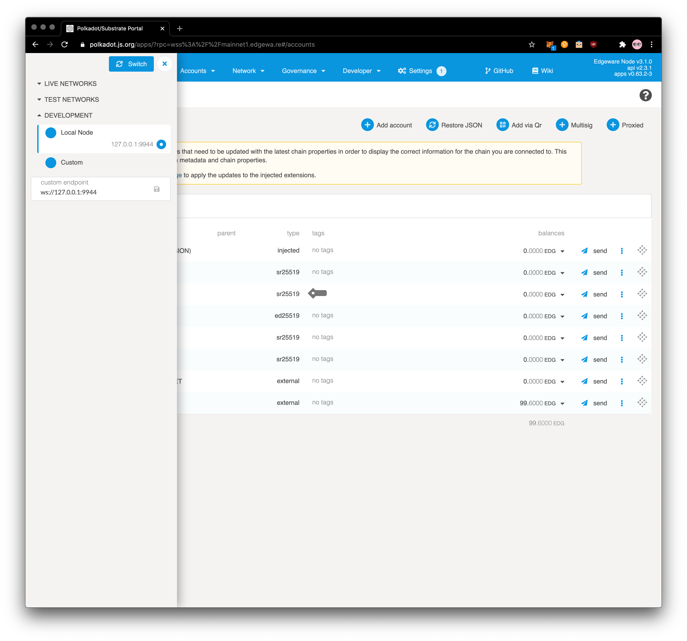
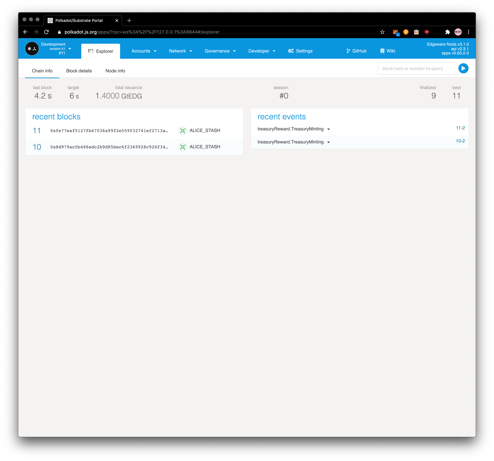

Running an Edgeware Node
===

We want to provide a fast setup experience for you. If you have Docker, you can launch an Edgeware development node in a few seconds:

> **Note** If you don't have [Docker installed, you can quickly install it from here](https://docs.docker.com/get-docker/)

```bash
git clone https://github.com/yangwao/substrate_playground; cd substrate_playground;
docker-compose up
```

> **Note:** If you have run this command in the past, you probably want to purge your chain storage, so that you run through this tutorial with a clean slate. You can do this easily by using `docker-compose rm` to delete your existing docker volume.


You should start to see blocks being produced by your node in your terminal.

You can interact with your node using the Polkadot UI:

https://polkadot.js.org/apps/

> **Note:** You will need to use a Chromium based browser (Google Chrome) to have this site interact with your local node. The Polkadot UI is hosted on a secure server, and your local node is not, which may cause compatibility issues on Firefox. The other option is to [clone and run the Polkadot UI locally](https://github.com/polkadot-js/apps).

To point the UI to your local node, you need to adjust the **Settings**. Just select 'Local Node (127.0.0.1:9944)' from the endpoint dropdown:

```
Click on the chain name > Development node/endpoint to connect to > Local Node (127.0.0.1:9944) > Switch
```



If you go into the **Explorer** tab of the UI, you should also see blocks being produced!


