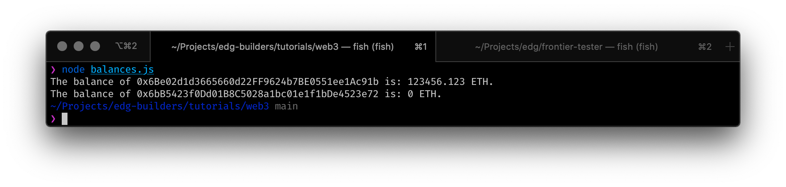
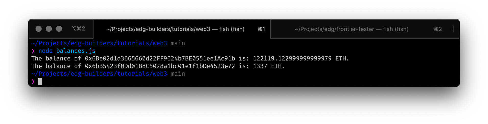

# Introduction 

This guide walks through the process of using Web3 to manually sign and send a transaction to a Edgeware EVM dev node. For this example, we will use Node.js and straightforward JavaScript code.

> **Note** This tutorial was created using the release of Edgeware EVM. The Edgeware EVM platform, and the [Frontier](https://github.com/paritytech/frontier) components it relies on for Substrate-based Ethereum compatibility, are still under very active development. We have created this tutorial so you can test out Edgeware's Ethereum compatibility features. Even though we are still in development, we believe it’s important that interested community members and developers have the opportunity to start to try things with Edgeware and provide feedback.

### Checking Prerequisities

Installed [Nodejs](https://nodejs.org/en/) and particular package manager like [yarn](https://classic.yarnpkg.com/en/docs/install/#mac-stable) or [npm](https://www.npmjs.com/get-npm), rest we have batteries included in this tutorial. 
This guide assumes that you have a [running local Edgeware EVM node running in `--dev` mode.](4/setting-up-a-local-node.md). 

```shell
git clone https://github.com/edgeware-builders/tutorials tutorials;cd tutorials/web3;yarn
```
It will move to your cloned repository, install required packages and you are ready to go!

### Creating Transaction

For this example, we only need a single Javscript file to create the transaction, which we will run using the `node` command in the terminal. The script will transfer 1337 ETH from the genesis account to another address. For simplicity, the file is divided into three sections: variable definition, create transactions and broadcast transaction.

We need to set a couple of values in the variables definitions: 
* Create our Web3 constructor (`web3`)
* Define the `privKey` varibalbe as the private key of our genesis account, which is where all the fund are stored when deploygin your local Edgeware EVM node and what is used to sign the transactions
* Set the "from" and "to" address, making sure to set the value of `toAddress` to a different address, for example the one created by MetaMask when setting up a local wallet


```javascript
const Web3 = require('web3');

const privKey =
  '99B3C12287537E38C90A9219D4CB074A89A16E9CDB20BF85728EBD97C343E342'; // Genesis private key
const addressFrom = '0x6Be02d1d3665660d22FF9624b7BE0551ee1Ac91b';
const addressTo = '0xB90168C8CBcd351D069ffFdA7B71cd846924d551';
const web3 = new Web3('http://localhost:9933');
```

Both the *create transaction* and *deploy transaction* sections are wrapped in an asynchronous function that handles the promises from our Web3 instance. To create the transaction, we use the `web3.eth.accounts.signTransaction(tx, privKey)` command, where we have to define the tx object with some parameters such as: `addressFrom`, `addressTo`, `number of tokens to send`, and the `gas limit`.

```javascript
const deploy = async () => {
  console.log(
    `Attempting to make transaction from ${addressFrom} to ${addressTo}`
  );

  const createTransaction = await web3.eth.accounts.signTransaction(
    {
      from: addressFrom,
      to: addressTo,
      value: web3.utils.toWei('1337', 'ether'),
      gas: '2100000000',
    },
    privKey
  );
```

Complete `createTransaction.js` should look like this! 

```javascript
const Web3 = require('web3');

const privKey =
  '99B3C12287537E38C90A9219D4CB074A89A16E9CDB20BF85728EBD97C343E342'; // Genesis private key
const addressFrom = '0x6Be02d1d3665660d22FF9624b7BE0551ee1Ac91b';
const addressTo = '0xB90168C8CBcd351D069ffFdA7B71cd846924d551';
const web3 = new Web3('http://localhost:9933');

// Create transaction
const deploy = async () => {
  console.log(
    `Attempting to make transaction from ${addressFrom} to ${addressTo}`
  );

  const createTransaction = await web3.eth.accounts.signTransaction(
    {
      from: addressFrom,
      to: addressTo,
      value: web3.utils.toWei('1337', 'ether'),
      gas: '2100000000',
    },
    privKey
  );

  // Deploy transaction
  const createReceipt = await web3.eth.sendSignedTransaction(
    createTransaction.rawTransaction
  );
  console.log(
    `Transaction successful with hash: ${createReceipt.transactionHash}`
  );
};

deploy();
```

### Check balance on accounts 

Before running the script, we need another file to check the balances of both addresses before and after the transaction is executed. We can easily do this by leveraging the Ethereum compatibility features of Edgeware.

`balances.js` looks like this:

```javascript
const Web3 = require('web3');

// Variables definition
const addressFrom = '0x6Be02d1d3665660d22FF9624b7BE0551ee1Ac91b';
const addressTo = '0x6bB5423f0Dd01B8C5028a1bc01e1f1bDe4523e72';
const web3 = new Web3('http://127.0.0.1:9933');

// Balance call
const balances = async () => {
  const balanceFrom = web3.utils.fromWei(
    await web3.eth.getBalance(addressFrom),
    'ether'
  );
  const balanceTo = await web3.utils.fromWei(
    await web3.eth.getBalance(addressTo),
    'ether'
  );

  console.log(`The balance of ${addressFrom} is: ${balanceFrom} ETH.`);
  console.log(`The balance of ${addressTo} is: ${balanceTo} ETH.`);
};

balances();
```

### Play time 

Run `node balance.js` to check initial balance on accounts



Run `node createTransaction.js` to transfer some stuff around chain


Run `node balance.js` to check result balances



### Reach us for more engagement

Glad you've made it through! 🥰 We are eager to guide your more on your exploration through Edgeware Ethereum compability feature. We are **keen to hear your experience and suggestion you may for us.**. You can feel free to [chat with us in the Edgeware's channels like Discord, Element and Telegram](https://linktr.ee/edg_developers), we can help you out with issues you may have or project you may want to be funded through our [Treasury program](https://docs.edgewa.re/edgeware-runtime/treasury). Don't hesitate to share your feedback on our channels, there is always space to improve! 🙌
