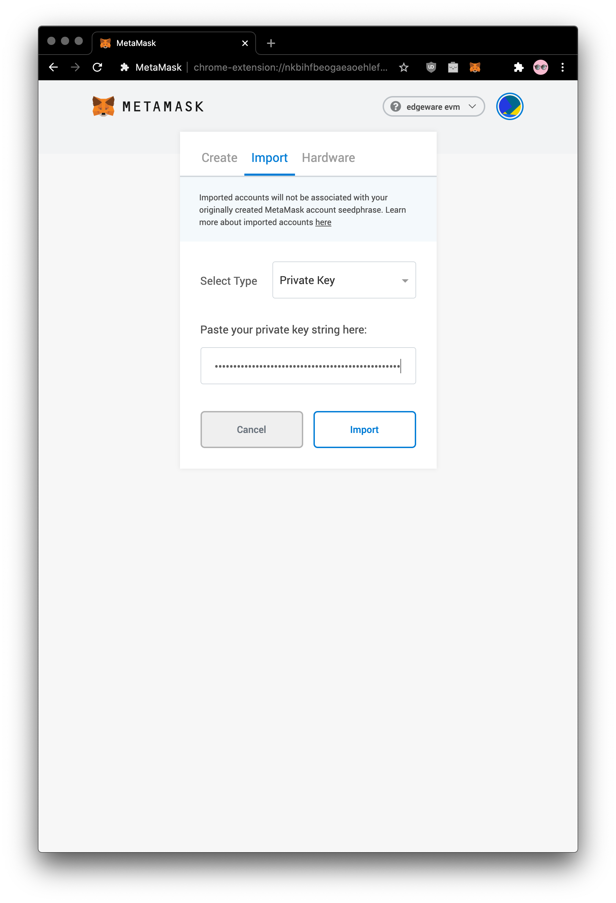
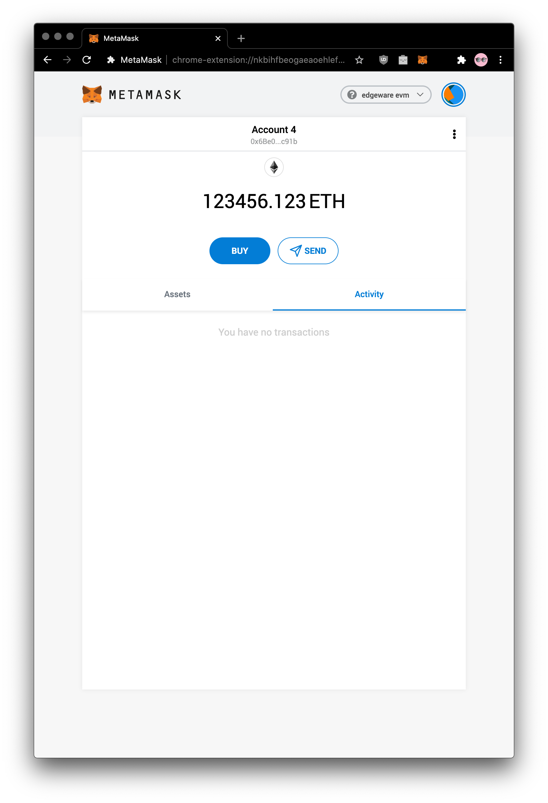
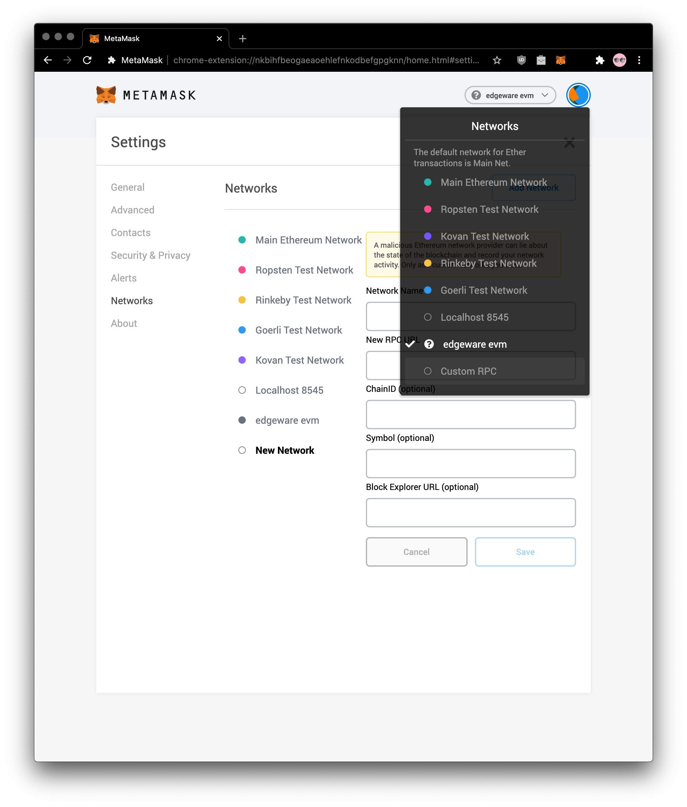
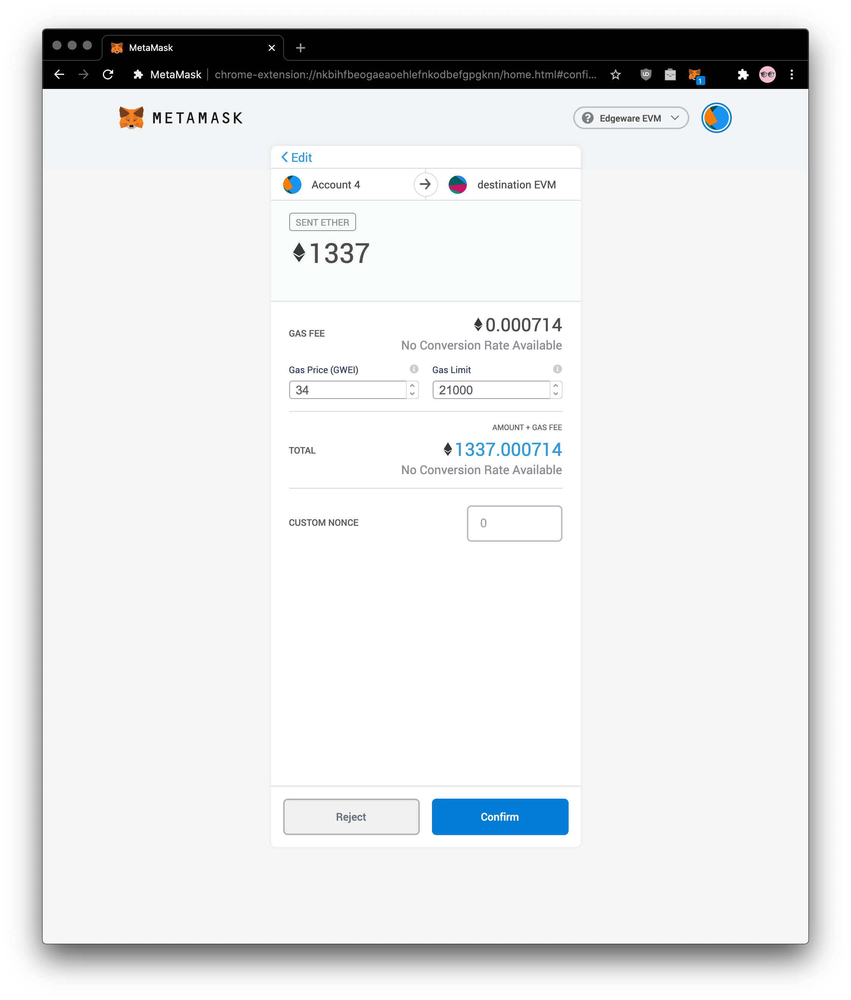
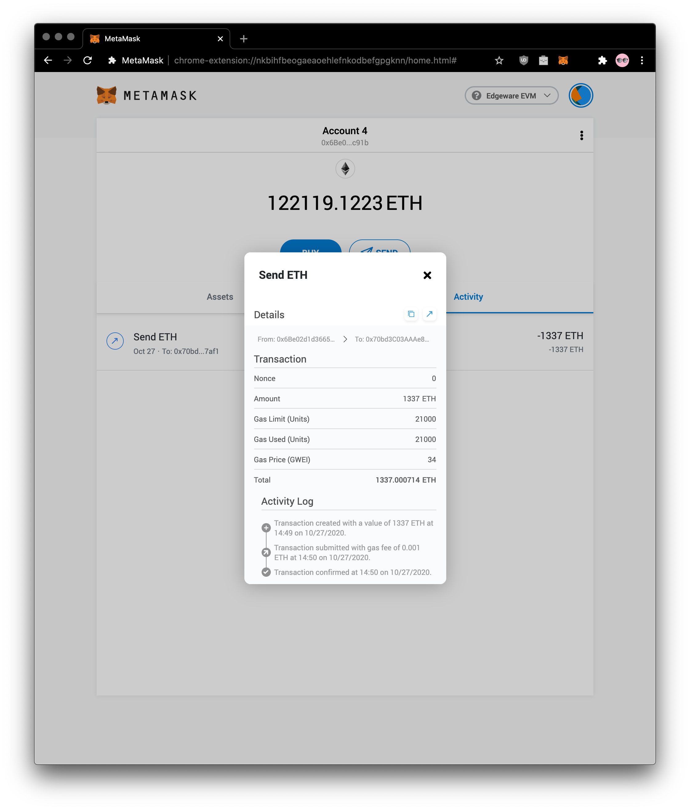

# Using Metamask

## Introduction

This guide will show you steps for using a self-contained Edgeware dev node to send tokens between EVM accounts with Metamask. To setup your own local node, learn more at this tutorial.

In this tutorial we will use the web3 rpc endpoints to interact with Edgeware

## Install the MetaMask Extension

First, we start with a fresh and default [Metamask installation from the Chrome store](https://chrome.google.com/webstore/detail/metamask/nkbihfbeogaeaoehlefnkodbefgpgknn?hl=en). Follow the "Get Started" guide, where you need to create a wallet, set a password and store your secret backup phrase. \(this gives direct access to your funds, so make sure to store these in a secure place\).

## Import Developer Account

Once completed, we will import our dev account. For easier interaction, you can [expand Metamask view to dedicated tab](chrome-extension://nkbihfbeogaeaoehlefnkodbefgpgknn/home.html#). Click on upper right corner for accounts and hit `Import Account`:

We have prefunded developer account for this purpose:

Private Key: `1111111111111111111111111111111111111111111111111111111111111111`

Address: `0x19e7e376e7c213b7e7e7e46cc70a5dd086daff2a`

On the import screen, select **"Private Key"** and paste there private key listed above and hit **Import**:

You should see that account imported with wild balance \(123456.123E\) for our needs, in our case it's **Account 4**, it may differ in your enviroment.

## Connect to the Local Edgeware Developer Node

Now let's connect MetaMask to our locally running Edgeware EVM node. On upper right, hit Networks and click Custom RPC

Put there credentials Network Name: `Edgeware EVM` New RPC URL: `http://127.0.0.1:9933` ChainID: `2021`

and hit **Save** button. Your can see it in figure below

## Make a Transfer

Now to verify your setup, you can try to make transfer between accounts. Don't worry, it's free! ;\)

As new account, you should notice Nonce should be 0

Once is transaction in the block, you should see confirmed transaction like this

## Reach us for more engagement

Glad you've made it through! 🥰 We are eager to guide your more on your exploration through Edgeware Ethereum compability feature. We are **keen to hear your experience and suggestion you may for us.**. You can feel free to [chat with us in the Edgeware's channels like Discord, Element and Telegram](https://linktr.ee/edg_developers), we can help you out with issues you may have or project you may want to be funded through our [Treasury program](https://docs.edgewa.re/edgeware-runtime/treasury). Don't hesitate to share your feedback on our channels, there is always space to improve! 🙌

