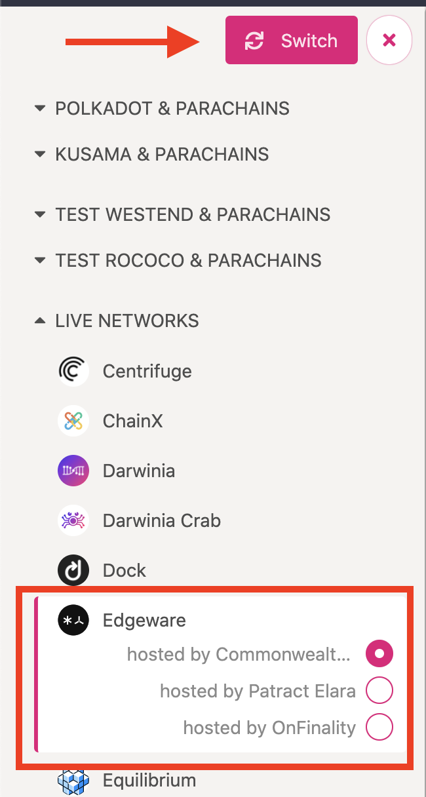
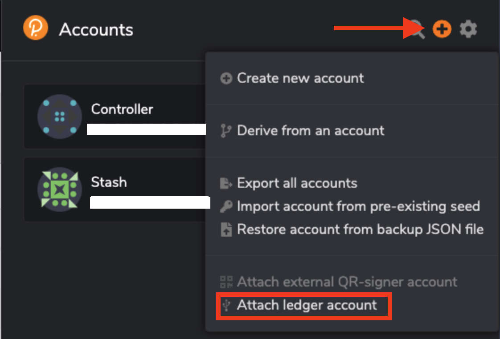
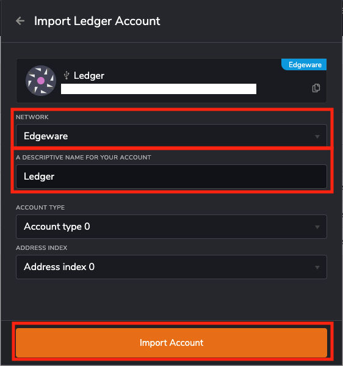
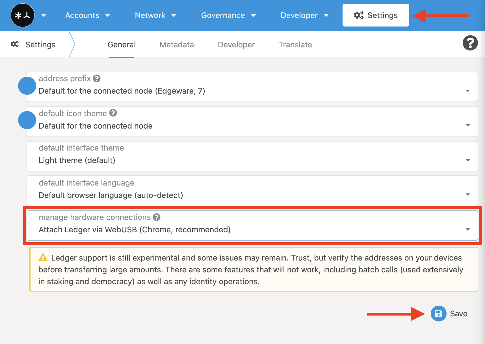
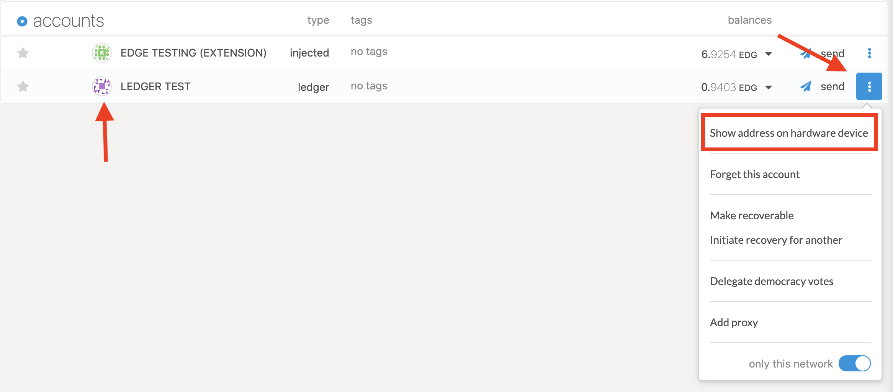
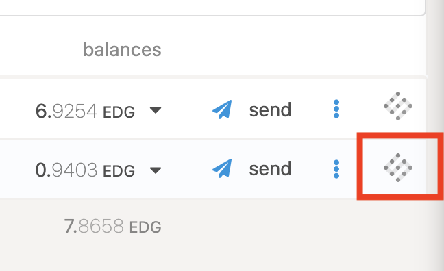
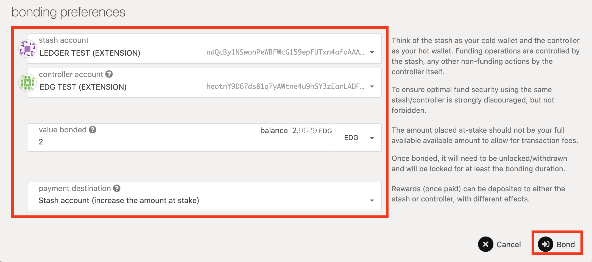
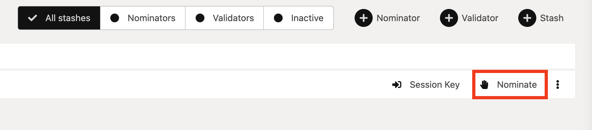

# Ledger

## Setup your Ledger Device

A Ledger Device is a hardware wallet that is considered one of the most secure ways to store your digital assets. Ledger uses an offline, or cold storage, method of generating private keys, making it a preferred method for many crypto users. This guide will help you to connect your Ledger device to an Edgeware account. The Edgeware account enables you to Send and Receive EDG.

## Before you start, Make sure

1. You’ve [initialized](https://support.ledger.com/hc/en-us/articles/360000613793?docs=true) your Ledger Device.
2. The latest firmware is [installed](https://support.ledger.com/hc/en-us/articles/360002731113?docs=true)
3. Ledger Live is _Ready to use_
4. Install the latest version of the Edgeware App

## Install The Edgeware App

1. Open the Manager in Ledger Live.
2. Connect and unlock your Ledger Device.
3. If asked, follow the onscreen instructions and Allow Ledger Manager.
4. Find Edgeware in the app catalog.
5. Click the Install button.

## Connect to the Edgeware Network

1. Go to [edgeware.app](https://edgeware.app) or [polkadot.js.org/apps](https://polkadot.js.org/apps/#/explorer)
2. Switch to Edgeware network from the drop down menu in the top left
   - Live Networks.
   - Edgeware.
   - Switch (at the top)

3. Connect and unlock your Ledger Device.
4. Open the Edgeware App on your Ledger Device
   You can either connect ledger to [polkadot web browser extension](https://polkadot.js.org/extension/) (this is recommended) or connect to polakdot apps website directly. Both methods are documented below.

## Connect Ledger to Polkadot web extension

1. Open polkadot web extension.
2. Click the plus icon on the top right.
3. Click "Attach ledger account".

4. Select Edgeware network
5. Give a descriptive name for you account.
6. Click Import Account.

## Connect Ledger to Polkadot apps Directly

1. Click on Settings in the menu bar.
   - Manage hardware connections.
   - Attach Ledger via WebUSB (Chrome, recommended)
   - Save.

1. First, connect and unlock your Ledger Device.
2. Open the Edgeware App on your Ledger Device
3. Click on Accounts in the menu bar
   - Add via Ledger.
   - Give an account name.
   - Make sure the Ledger device is plugged in unlocked with the Edgeware app open.
   - Save.

## Address Verification

1. Click the menu button beside send.
2. Show address on hardware device.
3. Double click approve or reject.
4. You can copy the address on your computer by clicking the icon beside the account name in this case it is LEDGER TEST. Make sure both addresses match.

## Send and Receive

1. To receive give your public address to the sender or to send to yourself follow these steps
   - From another account click send
   - Paste the Ledger address into send to address input or choose it with the drop down menu.
   - Enter amount.
   - Make Transfer.
   - You can see the blockchain history of a particular address on Subscan by clicking on the icon on the far right of the account.

2. To send from Ledger device
   - Click send.
   - Paste the recipients address in the send to address or use the drop down menu.
   - Enter amount.
   - Make sure the Ledger device is plugged in unlocked with the Edgeware app open.
   - Make Transfer.
   - On Ledger device use the right button to go through the menus. Verify that it is the correct receiving address and EDG amount on the device. double click on approve or reject accordingly.

.png>)

## View Balance

There are a few ways to view your balance.

1.  When you look at accounts it is under balances. You can also click on the down arrow to view more details.
2.  you can click the subscan icon to take you to subscan to see the full balance to the last decimal place.

## Staking with Ledger

1. To stake with ledger you must use [edgeware.app](https://edgeware.app) at the time of writing.
2. Use [polkadot web browser extension](https://polkadot.js.org/extension/)
3. Ledger is plugged in, unlocked, with edgeware app open.
4. Click Network > Staking > Account actions > +Stash.
5. Set the ledger account as the stash account. Use another account as controller account this is for transactions. Choose how much you want to stake/bond. Choose payment destination accordingly. Click Bond > Sign and Submit > Sign on Ledger. Verify the information on Ledger device double click approve or reject.

6. Click Nominate, Choose validators, click Nominate > Sign and Submit, Use controller account to sign the transaction.

7. Congratulations! you are staking with your Ledger.

## Trouble Shooting

1. Make sure you are using a **chromium-based browser** like google chrome or brave.
2. **If your ledger is not being recognized** you may have to open a new tab or window when connecting your ledger you can do this by right-clicking and open in new window or tab. Another solution you may have to change settings in polkadot apps. Under manage hardware connections have it set to “Do not attach Ledger device” then click save. You can’t use the Ledger device on polkadot apps and the web extension at the same time.

## Need Help?

Reach out to us.

- Discord: [https://discord.gg/tDxgyxym](https://discord.gg/mYk543EXBV)
- Telegram: [https://t.me/heyedgeware](https://t.me/heyedgeware)
- Reddit: [https://www.reddit.com/r/edgeware/](https://www.reddit.com/r/edgeware/)
