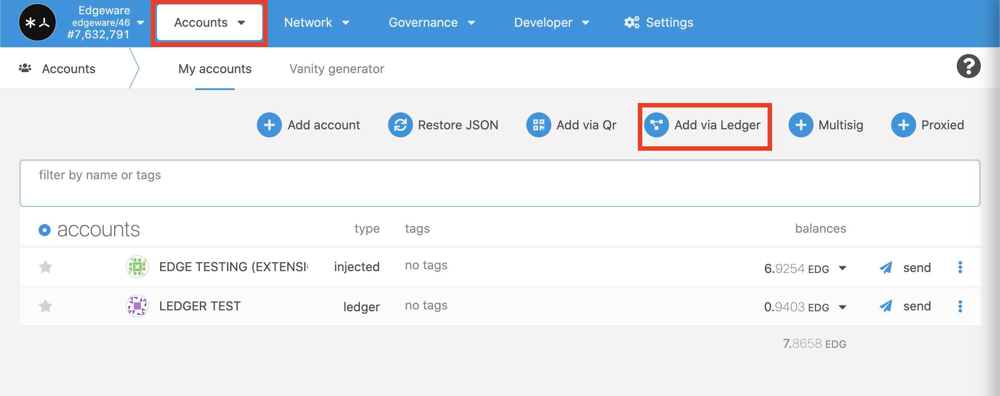
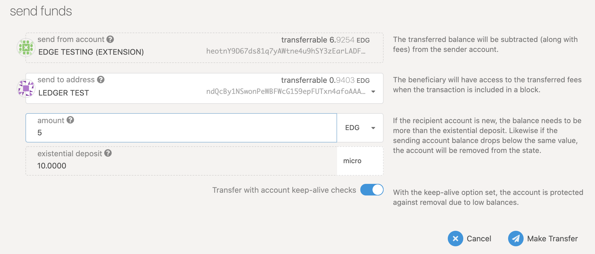

# Ledger

## Setup your Ledger Device

A Ledger Device is a hardware wallet that is considered one of the most secure ways to store your digital assets. Ledger uses an offline, or cold storage, method of generating private keys, making it a preferred method for many crypto users. This guide will help you to connect your Ledger device to an Edgeware account. The Edgeware account enables you to Send and Receive EDG.

## Before you start, Make sure

1. You’ve [initialized](https://support.ledger.com/hc/en-us/articles/360000613793?docs=true) your Ledger Device.
2. The latest firmware is [installed](https://support.ledger.com/hc/en-us/articles/360002731113?docs=true) 
3. Ledger Live is _Ready to use_
4. Install the latest version of the Edgeware App

## Install The Edgeware App

1. Open the Manager in Ledger Live.
2. Connect and unlock your Ledger Device.
3. If asked, follow the onscreen instructions and Allow Ledger Manager.
4. Find Edgeware in the app catalog.
5. Click the Install button.

## Connecting to the Edgeware Wallet

1. First, connect and unlock your Ledger Device.
2. Open the Edgeware App on your Ledger Device
3. Go to _polkadot.js.org/apps_
4. Switch to Edgeware network from the drop down menu in the top left
   * Live Networks.
   * Edgeware.
   * Switch \(at the top\)

     
5. Click on Settings in the menu bar.
   * Manage hardware connections.
   * Attach Ledger via WebUSB \(Chrome, recommended\)
   * Save.

     
6. Click on Accounts in the menu bar
   * Add via Ledger.
   * Give an account name.
   * Make sure the Ledger device is plugged in unlocked with the Edgeware app open.
   * Save.

     

## Address Verification

1. Click the menu button beside send. 
2. Show address on hardware device.
3. Double click approve or reject. 
4. You can copy the address on your computer by clicking the icon beside the account name in this case it is LEDGER TEST. Make sure both addresses match.

   

## Send and Receive

1. To receive give your public address to the sender or to send to yourself follow these steps
   * From another account click send
   * Paste the Ledger address into send to address input or choose it with the drop down menu.
   * Enter amount.
   * Make Transfer.
   * You can see the blockchain history of a particular address on Subscan by clicking on the icon on the far right of the account. 

     
2. To send from Ledger device
   * Click send. 
   * Paste the recipients address in the send to address or use the drop down menu. 
   * Enter amount.
   * Make sure the Ledger device is plugged in unlocked with the Edgeware app open.
   * Make Transfer.
   * On Ledger device use the right button to go through the menus. Verify that it is the correct receiving address and EDG amount on the device. double click on approve or reject accordingly. 

     

